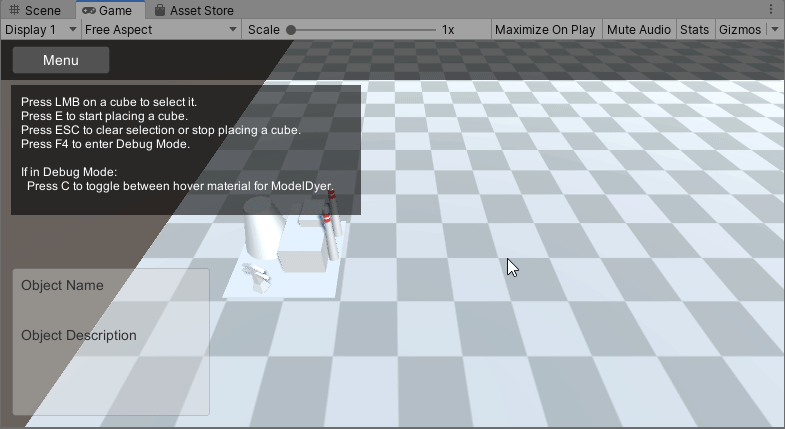

# Poles Plants POWER! 

Prototype for a power plant simulation game. Made in Unity. 

## Features 

* Navigation in game world with camera 
* Selecting and hovering buildings 
* Placing buildings in a grid 
* Demolishing buildings 
* Creating of power grids when placing electric buildings 
* Merging and dissolving of power grids (power grids are *graphs*) 
* Simple user interface 
* Simple models for buildings, based on *primitives* 

## Gifs 

  
*Building a powerplant* 

  
*Creating of a power grid* 

  
*Creating, merging and dissolving of power grids* 

## Credits 

Made by Lukas Semmler (c) 2019. 
